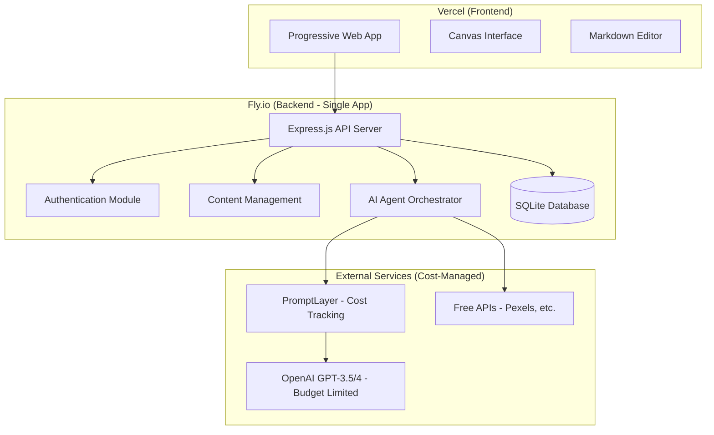

# Design Document

## Overview

Primal Marc is a cost-effective web application built as a Progressive Web App (PWA) that provides AI-powered writing assistance through four specialized agents. The application features a canvas-based collaborative interface where users interact with AI agents in real-time to develop content from initial ideation through final publication. The system is designed with a simplified monolithic architecture optimized for hobby project constraints, utilizing Vercel for frontend hosting and Fly.io for backend services within a $50 budget.

## Architecture

### High-Level Architecture



### Technology Stack

**Frontend (Vercel - Free Tier):**
- React 18 with TypeScript for component-based UI
- Tailwind CSS + shadcn/ui for responsive design
- Monaco Editor for markdown editing with syntax highlighting
- React Query for state management and caching
- Socket.io client for real-time collaboration
- Workbox for PWA capabilities

**Backend (Fly.io - $50 Budget):**
- Node.js with Express.js for API services
- TypeScript for type safety
- Socket.io for real-time communication
- JWT for authentication
- Prisma ORM with SQLite for cost-effective database

**Database & Storage (Cost-Optimized):**
- SQLite for user data and content (file-based, no hosting costs)
- Local file storage for media with compression
- Cloudinary free tier for image optimization

**AI & External Services (Budget-Managed):**
- PromptLayer for cost tracking and LLM management
- OpenAI GPT-3.5-turbo as primary LLM (cost-effective)
- GPT-4 for premium features only (budget permitting)
- Free APIs: Pexels for images, free meme generators
- Free web search APIs for fact-checking

## Components and Interfaces

### Frontend Components

#### Canvas Interface Component
```typescript
interface CanvasProps {
  projectId: string;
  currentPhase: WritingPhase;
  onPhaseChange: (phase: WritingPhase) => void;
}

interface WritingPhase {
  id: string;
  name: 'ideation' | 'refinement' | 'media' | 'factcheck';
  status: 'active' | 'completed' | 'pending';
}
```

#### AI Agent Chat Component
```typescript
interface AgentChatProps {
  agentType: AgentType;
  conversationId: string;
  onContentUpdate: (content: string) => void;
}

interface Message {
  id: string;
  role: 'user' | 'agent';
  content: string;
  timestamp: Date;
  agentType?: AgentType;
}
```

#### Markdown Editor Component
```typescript
interface MarkdownEditorProps {
  content: string;
  onChange: (content: string) => void;
  readOnly?: boolean;
  collaborativeMode?: boolean;
}
```

### Backend Services

#### AI Agent Orchestrator
```typescript
interface AgentRequest {
  agentType: AgentType;
  userId: string;
  projectId: string;
  content: string;
  context?: AgentContext;
}

interface AgentResponse {
  content: string;
  suggestions: Suggestion[];
  metadata: AgentMetadata;
}

interface AgentContext {
  previousPhases: PhaseResult[];
  userPreferences: UserPreferences;
  styleGuide?: StyleGuide;
}
```

#### Content Management Service
```typescript
interface Project {
  id: string;
  userId: string;
  title: string;
  content: string;
  currentPhase: WritingPhase;
  createdAt: Date;
  updatedAt: Date;
  metadata: ProjectMetadata;
}

interface ProjectMetadata {
  wordCount: number;
  estimatedReadTime: number;
  tags: string[];
  targetAudience?: string;
}
```

### AI Agent Interfaces

#### Ideation Agent
```typescript
interface IdeationAgent {
  generatePrompts(topic?: string): Promise<string[]>;
  brainstorm(userInput: string): Promise<IdeationResponse>;
  structureConcepts(ideas: string[]): Promise<ConceptStructure>;
}

interface ConceptStructure {
  mainTheme: string;
  keyPoints: string[];
  suggestedOutline: OutlineItem[];
}
```

#### Draft Refiner Agent
```typescript
interface DraftRefinerAgent {
  analyzeStructure(content: string): Promise<StructureAnalysis>;
  refineStyle(content: string, styleGuide: StyleGuide): Promise<StyleSuggestions>;
  improveFlow(content: string): Promise<FlowSuggestions>;
}

interface StyleGuide {
  referenceWriters?: string[];
  toneDescription?: string;
  exampleText?: string;
  targetAudience?: string;
}
```

#### Media Agent
```typescript
interface MediaAgent {
  generateMeme(context: string, memeType?: string): Promise<MemeResult>;
  findRelevantImages(content: string): Promise<ImageSuggestion[]>;
  createChart(data: ChartData): Promise<ChartResult>;
  generateOriginalImage(prompt: string): Promise<ImageResult>;
}
```

#### Fact-Checker/SEO Agent
```typescript
interface FactCheckerAgent {
  identifyFactualClaims(content: string): Promise<FactualClaim[]>;
  verifyFacts(claims: FactualClaim[]): Promise<FactCheckResult[]>;
  suggestSEOImprovements(content: string): Promise<SEOSuggestions>;
  findRelevantSources(topic: string): Promise<SourceSuggestion[]>;
}
```

## Data Models

### User Model
```typescript
interface User {
  id: string;
  email: string;
  passwordHash: string;
  profile: UserProfile;
  preferences: UserPreferences;
  subscription: SubscriptionInfo;
  createdAt: Date;
  updatedAt: Date;
}

interface UserProfile {
  firstName: string;
  lastName: string;
  bio?: string;
  writingGenres: string[];
  experienceLevel: 'beginner' | 'intermediate' | 'advanced';
}

interface UserPreferences {
  defaultStyleGuide?: StyleGuide;
  preferredAgentPersonality: 'formal' | 'casual' | 'creative';
  autoSaveInterval: number;
  notificationSettings: NotificationSettings;
}
```

### Project Model
```typescript
interface Project {
  id: string;
  userId: string;
  title: string;
  content: string;
  phases: ProjectPhase[];
  currentPhaseId: string;
  status: 'draft' | 'in_progress' | 'completed';
  metadata: ProjectMetadata;
  createdAt: Date;
  updatedAt: Date;
}

interface ProjectPhase {
  id: string;
  type: 'ideation' | 'refinement' | 'media' | 'factcheck';
  status: 'pending' | 'active' | 'completed';
  agentConversations: Conversation[];
  outputs: PhaseOutput[];
  completedAt?: Date;
}
```

### Conversation Model
```typescript
interface Conversation {
  id: string;
  projectId: string;
  agentType: AgentType;
  messages: Message[];
  context: ConversationContext;
  createdAt: Date;
  updatedAt: Date;
}

interface ConversationContext {
  phaseType: WritingPhase['name'];
  userGoals: string[];
  previousOutputs: PhaseOutput[];
}
```

## Error Handling

### Client-Side Error Handling
- Network connectivity issues: Implement offline mode with local storage
- API failures: Retry logic with exponential backoff
- Real-time connection drops: Automatic reconnection with state synchronization
- Validation errors: Inline form validation with clear error messages

### Server-Side Error Handling
- LLM API failures: Fallback to alternative providers or cached responses
- Database connection issues: Connection pooling with retry logic
- Authentication errors: Clear error messages with recovery options
- Rate limiting: Graceful degradation with user notification

### AI Agent Error Handling
- Prompt failures: Fallback prompts and error recovery
- Content generation timeouts: Partial response handling
- Invalid responses: Response validation and regeneration
- Context overflow: Intelligent context trimming

## Testing Strategy

### Unit Testing
- Frontend components with React Testing Library
- Backend services with Jest
- AI agent logic with mocked LLM responses
- Database operations with test database

### Integration Testing
- API endpoint testing with Supertest
- Real-time communication testing
- Authentication flow testing
- AI agent integration testing with PromptLayer

### End-to-End Testing
- User workflow testing with Playwright
- Cross-device synchronization testing
- Performance testing under load
- Accessibility testing for mobile and desktop

### AI-Specific Testing
- Prompt evaluation with PromptLayer
- Response quality assessment
- Agent conversation flow testing
- Content generation accuracy testing

## Security Considerations

### Authentication & Authorization
- JWT tokens with refresh token rotation
- Role-based access control for admin features
- Rate limiting on authentication endpoints
- Password strength requirements and hashing

### Data Protection
- Encryption at rest for sensitive user data
- HTTPS enforcement for all communications
- Input sanitization and validation
- SQL injection prevention with parameterized queries

### AI Security
- Prompt injection prevention
- Content filtering for inappropriate outputs
- User data privacy in LLM interactions
- Audit logging for all AI agent interactions

## Cost Optimization and Performance

### Cost Management
- PromptLayer integration for real-time cost tracking and alerts
- Token usage optimization with context trimming and caching
- Rate limiting to prevent cost overruns
- Graceful degradation when budget limits are approached
- User usage quotas with clear communication

### Frontend Performance (Vercel Optimized)
- Code splitting and lazy loading for minimal bundle size
- Image optimization with Vercel's built-in optimization
- Service worker caching strategies
- Virtual scrolling for long conversations

### Backend Performance (Fly.io Optimized)
- SQLite optimization with proper indexing
- In-memory caching for frequently accessed data
- Efficient resource usage to stay within Fly.io limits
- Connection pooling for external API calls

### AI Cost Optimization
- Response caching for identical/similar requests
- Prompt engineering for shorter, more effective prompts
- Model selection based on task complexity (GPT-3.5 vs GPT-4)
- Context optimization to minimize token usage
- Batch processing where possible to reduce API calls
#
# Cost Analysis

**Accurate Budget Breakdown**:
- **Fly.io backend**: ~$5-10/month (shared-cpu-1x, 256MB RAM, minimal usage)
- **Vercel frontend**: Free tier (hobby projects, generous limits)
- **PromptLayer**: Free tier (up to 1000 requests/month)
- **LLM costs**: $10-20/month estimated (GPT-3.5-turbo with optimized usage)
- **Other services**: Free tiers (Pexels, Cloudinary, DuckDuckGo search)

**Total estimated monthly cost: $15-30**, meaning your $50 Fly.io credits will last 2-3+ months, providing excellent runway to validate and optimize the project.

**Cost Optimization Strategies**:
- Start with Fly.io's smallest instance (shared-cpu-1x, 256MB)
- Use SQLite to avoid database hosting costs
- Implement aggressive caching to reduce LLM API calls
- Set up PromptLayer budget alerts at $15/month
- Use free tiers for all non-essential services
- Scale resources only when needed based on actual usage