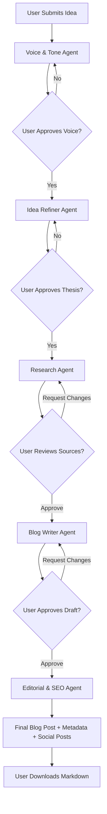
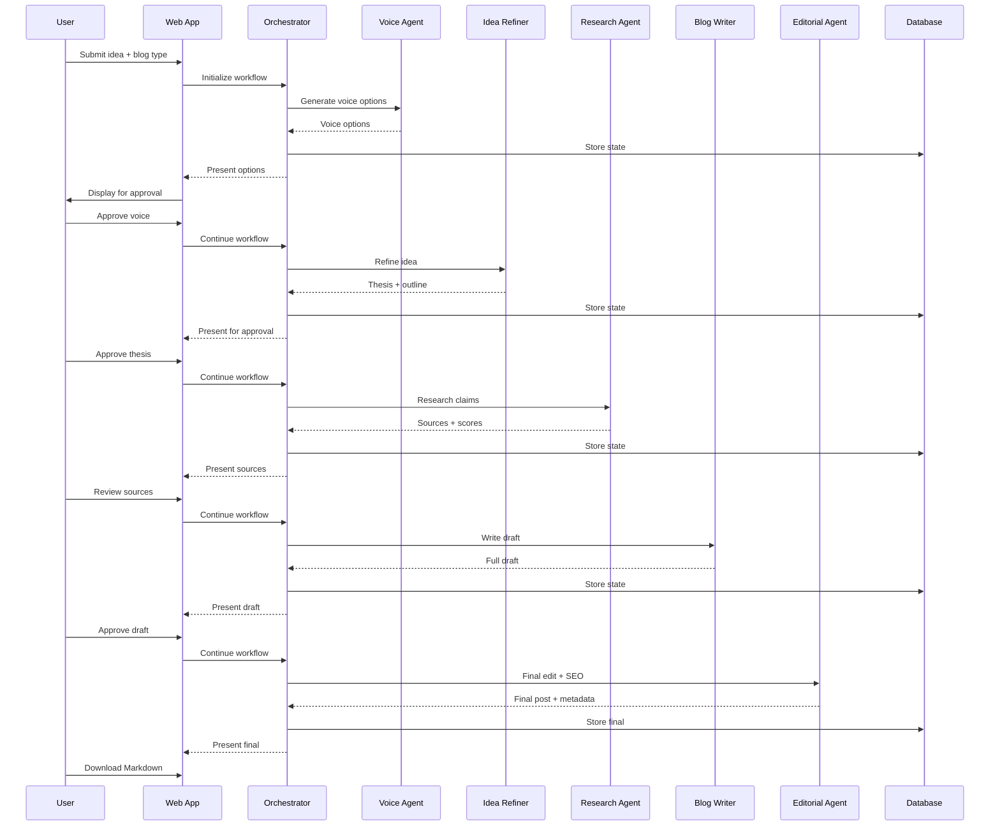

# Blog Generator Application - Product Requirements Document

## 1. Executive Summary

**Product Name:** Blog Generator (working title)

**Vision:** An AI-powered blog writing application that helps users transform rough ideas into professional-quality blog posts through a collaborative workflow with specialized AI agents, ensuring high-quality output with proper citations, SEO optimization, and social media integration.

**Key Value Proposition:**

- Transform vague ideas into structured, defensible blog posts
- Professional-quality output across 5 distinct blog types
- Human-in-the-loop approvals at critical decision points
- Automated research, citation, SEO, and social post generation

## 2. Product Overview

### 2.1 Core Functionality

A web application that orchestrates 5 specialized AI agents to guide users through a structured blog creation workflow:

1. **Voice & Tone Agent** - Establishes writing style
2. **Idea Refiner Agent** - Develops thesis and outline
3. **Research Agent** - Validates claims and finds sources
4. **Blog Writer Agent** - Produces full draft
5. **Editorial & SEO Agent** - Final polish and optimization

### 2.2 Supported Blog Types

- **Academic/Research**: Technical, in-depth articles analyzing research, methods, or best practices
- **Argumentative**: Opinion-driven posts with strong stance and reasoned support
- **Lessons from Experience**: Reflective posts sharing personal/team experiences and takeaways
- **Experiential Metaphor**: Posts illustrating concepts through analogy and real-world examples
- **Systems/Workflow Deep Dive**: Detailed breakdowns of processes, architectures, or workflows

### 2.3 Goals

- Produce high-quality blogs matching professional writer standards
- Include citations, SEO metadata, and social posts automatically
- Support human-in-the-loop approvals at key checkpoints
- Enable full iteration workflow (users can revisit any step)

### 2.4 Non-Goals

- Full automated publishing (users export/download content)
- Keyword-stuffed content
- Multi-format export in v1 (Markdown only)
- Version history tracking in v1 (future feature)

## 3. User Personas

### Primary Persona: Thought Leader / Content Creator

**Characteristics:**

- Shares ideas publicly (blogs, social media, talks)
- Values quality and credibility over speed
- Time-constrained but quality-sensitive
- Needs citations and proper sourcing

**Jobs to be Done:**

- Transform rough ideas into structured, publishable content
- Ensure claims are backed by research
- Generate SEO-optimized content with social posts
- Maintain consistent voice and tone

## 4. User Stories & Workflow

### 4.1 User Journey

### 4.2 Key User Stories

**US-1: Idea Submission**

- As a user, I want to submit a rough blog idea and select a blog type, so that the system can guide me through the appropriate workflow.

**US-2: Voice & Tone Selection**

- As a user, I want to see 3 voice/tone options tailored to my blog type, so that I can choose the style that matches my brand.

**US-3: Thesis Refinement**

- As a user, I want to see multiple thesis options with clear implications, so that I can select the most compelling direction.

**US-4: Research Validation**

- As a user, I want to see quality-scored sources for my claims, so that I can ensure my blog post is credible and well-sourced.

**US-5: Draft Review**

- As a user, I want to review the full draft before final editing, so that I can request changes or approve for final polish.

**US-6: Iteration**

- As a user, I want to go back to any previous step and re-run agents, so that I can refine my blog post iteratively.

**US-7: Export**

- As a user, I want to download my final blog post as Markdown, so that I can publish it to my preferred platform.

## 5. Technical Architecture

### 5.1 Technology Stack

- **Frontend Framework:** React (via Next.js)
- **Backend Framework:** Next.js API routes
- **Orchestration Framework:** LangChain.js (JavaScript/TypeScript)
- **User Interface:** Web application (browser-based)
- **UI Component Library:** ShadCN UI
- **Additional UI Components:** KokonutUI
- **Icons:** Lucide Icons
- **Styling:** Tailwind CSS
- **Database:** NeonDB (serverless PostgreSQL)
- **Authentication:** Clerk (email/password with easy NeonDB integration)
- **Deployment:** Netlify (frontend + serverless functions)
- **LLM Observability:** Opik by Comet.com (tracing and monitoring)
- **Analytics:** PostHog (user behavior and product analytics)
- **API Management:** User-provided API keys (OpenAI, Anthropic, etc.)

### 5.2 Agent Architecture

Each agent is implemented as a LangChain agent with:

- **Prompt Template:** Loaded from `agents/{agent_name}_agent.md`
- **LLM Configuration:** Configurable per user (API key management)
- **Input Validation:** Ensures required inputs from previous steps
- **Output Schema:** Structured output for next agent or user approval

### 5.3 Data Flow

## 6. Agent Specifications

### 6.1 Voice & Tone Agent

- **Input:** Blog post type, thesis (optional)
- **Output:** 3 voice/tone options with descriptions
- **Checkpoint:** User selects preferred option
- **Prompt Source:** `agents/voice_and_tone_agent.md`

### 6.2 Idea Refiner Agent

- **Input:** User's initial idea, selected blog post type, selected voice/tone
- **Output:** 
  - Approved thesis/anchoring statement
  - Structured outline (2-5 sections)
  - Evidence expectations per section
  - Conclusion intent
- **Checkpoint:** User approves thesis and outline
- **Prompt Source:** `agents/idea_refiner_agent.md`

### 6.3 Research Agent

- **Input:** Approved thesis, structured outline, evidence expectations
- **Output:**
  - Curated source list with links
  - Source quality scores (1-5 scale) with rationale
  - Mapping of sources to outline sections
  - Suggested thesis/outline revisions (if any)
- **Checkpoint:** User reviews sources (can request additional research)
- **Capabilities:** Web search access, source credibility assessment
- **Prompt Source:** `agents/research_agent.md`

### 6.4 Blog Writer Agent

- **Input:** Approved thesis, structured outline, research sources, selected voice/tone
- **Output:** Complete 600-1500 word blog post draft
- **Checkpoint:** User reviews and can approve or request changes
- **Rules:** Follow outline, integrate sources naturally, match voice
- **Prompt Source:** `agents/blog_writer_agent.md`

### 6.5 Editorial & SEO Agent

- **Input:** User-approved draft
- **Output:**
  - Final edited blog post
  - SEO metadata (title, meta description, H2 suggestions)
  - Social post suggestions (Twitter/X, LinkedIn)
- **Checkpoint:** Final review before export
- **Prompt Source:** `agents/editorial_and_seo_agent.md`

## 7. Data Model

### 7.1 Core Entities

**User**

- id, email, password_hash, created_at, updated_at

**BlogPost**

- id, user_id, title, blog_type, status, created_at, updated_at

**BlogPostState**

- id, blog_post_id, step_name, state_data (JSON), created_at
- Tracks state at each workflow step for iteration support

**VoiceToneSelection**

- id, blog_post_id, selected_option, style_guidelines (JSON)

**ThesisOutline**

- id, blog_post_id, thesis_statement, outline (JSON), conclusion_intent

**ResearchSources**

- id, blog_post_id, sources (JSON array with quality scores), section_mapping (JSON)

**BlogDraft**

- id, blog_post_id, content (text), word_count

**FinalPost**

- id, blog_post_id, content (text), seo_metadata (JSON), social_posts (JSON), citations (JSON)

**Template**

- id, user_id, name, blog_type, voice_tone, saved_state (JSON)
- For saved templates feature

## 8. User Interface Requirements

### 8.0 Design System

**Design Philosophy:**

- Open, airy design with clean modern typography
- Vibrant color accents for key interactions
- Inspiration: [Positivity Journal App Concept](https://dribbble.com/shots/5169394-Positivity-Journal-App-Concept-Day-252-365-Project365)

**Color Palette:**

- **Spicy Paprika** (`#e4572e`): Primary accent, CTAs, highlights
  - Full scale: 100-900 shades available
- **Tropical Teal** (`#17bebb`): Secondary accent, links, information
  - Full scale: 100-900 shades available
- **Bright Amber** (`#ffc914`): Tertiary accent, warnings, emphasis
  - Full scale: 100-900 shades available

**Component Libraries:**

- **ShadCN UI:** Base component system
- **KokonutUI:** Additional specialized components
- **Lucide Icons:** Icon system throughout application

**Typography:**

- Clean, modern font stack (to be specified in design phase)
- Generous line height and spacing for readability
- Clear hierarchy with appropriate font sizes

**Layout Principles:**

- Generous white space
- Card-based layouts for content sections
- Smooth transitions and animations
- Mobile-first responsive design

### 8.1 Workflow UI Components

**Step 1: Idea Submission**

- Text area for initial idea
- Blog type selector (dropdown or cards)
- Submit button

**Step 2: Voice & Tone Selection**

- Display 3 options with descriptions
- Radio buttons or cards for selection
- Preview of style guidelines
- Approve/Request Changes buttons

**Step 3: Thesis & Outline**

- Display thesis statement (editable)
- Display structured outline with section purposes
- Evidence expectations per section
- Approve/Request Changes buttons

**Step 4: Research Review**

- Source list with quality scores (1-5 stars)
- Links to sources
- Section mapping visualization
- Request Additional Research button
- Approve/Continue button

**Step 5: Draft Review**

- Full draft display (scrollable)
- Word count indicator
- Request Changes (with step selector) / Approve buttons
- Iteration history indicator

**Step 6: Final Review**

- Final edited post
- SEO metadata display (editable)
- Social post previews (Twitter, LinkedIn)
- Download Markdown button

### 8.2 Navigation & State Management

- Progress indicator showing current step
- Ability to navigate back to previous steps
- Clear indication of approved vs. pending steps
- Save draft functionality (auto-save)

### 8.3 Error States

- Agent failure notifications with retry options
- API key validation errors
- Network error handling
- Timeout handling with retry

## 9. API & Integration Requirements

### 9.1 LLM Provider Integration

- Support for multiple providers (OpenAI, Anthropic, etc.)
- User-provided API keys stored securely
- Rate limiting per user
- Cost tracking (optional, for user awareness)

### 9.2 Research Agent Web Search

- **Primary Research API:** Perplexity API
- **Fallback Research API:** Exa.ai (used if Perplexity fails)
- Source quality scoring algorithm
- Citation format: Markdown links (inline or reference style)
- Automatic fallback handling on API failures

### 9.3 Export Functionality

- Markdown download with proper formatting
- Include citations as markdown links
- Include SEO metadata as frontmatter
- Include social posts as separate sections

## 10. Error Handling & Resilience

### 10.1 Agent Failure Handling

- **Automatic Retries:** Exponential backoff for transient failures
- **User Notification:** Clear error messages with context
- **Fallback Options:** Alternative agent approaches where applicable
- **State Preservation:** Save progress before agent execution

### 10.2 API Error Handling

- API key validation on workflow start
- Rate limit detection and user notification
- Quota exhaustion handling
- Provider-specific error mapping

### 10.3 Data Integrity

- Transaction management for multi-step operations
- Rollback capability on critical failures
- State recovery mechanisms

## 11. Success Metrics

### 11.1 User Engagement

- Blog posts completed per user
- Average time to completion
- Iteration rate (how often users go back to previous steps)
- Template usage rate

### 11.2 Quality Metrics

- User approval rate at each checkpoint
- Average source quality scores
- Word count distribution (target: 600-1500 words)
- Citation count per post

### 11.3 Technical Metrics

- Agent success rate
- Average time per agent execution
- API error rate
- System uptime

## 12. Out of Scope (v1)

- Full automated publishing to CMS platforms
- PDF export
- HTML export
- Version history and comparison
- Collaborative editing
- Real-time collaboration
- Analytics dashboard
- A/B testing of agent outputs
- Custom citation formats beyond Markdown links
- Additional social platforms beyond Twitter/X and LinkedIn

## 13. Future Considerations

### 13.1 Planned Features

- **Version History:** Track all versions of blog posts through workflow
- **CMS Integration:** Direct publishing to WordPress, Ghost, etc.
- **Additional Export Formats:** HTML, PDF
- **More Social Platforms:** Bluesky, Threads, etc.
- **Advanced Templates:** User-created templates with saved workflows

### 13.2 Potential Enhancements

- Multi-language support
- Team collaboration features
- Analytics and insights
- Custom agent fine-tuning
- Integration with content calendars
- Batch processing for multiple ideas

## 14. Implementation Phases

### Phase 1: Core Workflow (MVP)

- User authentication and management
- Basic workflow orchestration with LangChain
- All 5 agents implemented
- Key checkpoints (thesis, draft, final)
- Markdown export

### Phase 2: Iteration & Polish

- Full iteration support (back to any step)
- Enhanced error handling
- Template system
- Improved UI/UX based on user feedback

### Phase 3: Advanced Features

- Additional export formats
- CMS integrations
- Analytics dashboard
- Version history

## 15. Dependencies & Assumptions

### 15.1 External Dependencies

- LangChain framework availability and stability
- LLM provider APIs (OpenAI, Anthropic, etc.)
- Perplexity API (primary) and Exa.ai (fallback) for research agent
- NeonDB (serverless PostgreSQL)

### 15.2 Assumptions

- Users have access to LLM API keys
- Users understand basic blog writing concepts
- Internet connectivity for research agent
- Standard web browser support

## 16. Risk Assessment

### 16.1 Technical Risks

- **Agent reliability:** LLM outputs may be inconsistent
  - *Mitigation:* Clear prompts, output validation, retry logic
- **API costs:** High usage may be expensive
  - *Mitigation:* User-provided API keys, cost transparency
- **Research quality:** Web search may return low-quality sources
  - *Mitigation:* Quality scoring, user review checkpoint

### 16.2 Product Risks

- **User expectations:** Users may expect fully automated publishing
  - *Mitigation:* Clear messaging about human-in-the-loop approach
- **Quality perception:** Output may not match professional writers
  - *Mitigation:* Iteration support, user refinement at checkpoints

## 17. Architecture Decisions

### 17.1 Resolved Decisions

1. **Frontend Framework:** React ✓
2. **Deployment Platform:** Netlify ✓ (NOT Vercel)
3. **Authentication:** Clerk (email/password) ✓
4. **Research API:** Perplexity API (primary), Exa.ai (fallback) ✓
5. **Database:** NeonDB (serverless PostgreSQL) ✓

### 17.2 Remaining Architecture Questions

1. **Backend Architecture:** To be determined

   - **Option A (Recommended):** Next.js full-stack app (API routes + React frontend, deployed to Netlify)
     - Uses LangChain.js (JavaScript/TypeScript)
     - Single codebase, easier deployment
     - Netlify supports Next.js natively
     - LangChain.js is mature and feature-complete for this use case
   - **Option B:** React frontend + Python backend via Netlify Functions
     - Uses LangChain Python (more mature ecosystem)
     - Requires Python runtime on Netlify (supported but less common)
     - Separate concerns but more complex deployment
   - **Option C:** React frontend + separate backend service
     - Most flexible but requires managing separate infrastructure
     - Not ideal for Netlify deployment
   - **Recommendation:** Option A (Next.js with LangChain.js) for simplicity and Netlify compatibility

2. **Authentication Solution:** Clerk ✓

   - Provides email/password authentication
   - Easy integration with NeonDB via user ID mapping
   - Includes user management UI components

3. **LangChain Implementation:**

   - If Python: Deploy via Netlify Functions (Python runtime) or separate backend service
   - If JavaScript: Use LangChain.js directly in Next.js API routes or Netlify Functions
   - **Consideration:** LangChain Python is more mature, but requires Python runtime on Netlify

---

**Document Status:** Complete
**Last Updated:** 2024
**Owner:** Product Team
